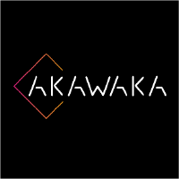

<header style="text-align: center;">

<h1>By Akawaka</h1>
<p>Akawaka is a web expert agency, visit <a target="_blank" href="//akawaka.fr">our website</a> for more information.</p>
</header>

# JavaScript Project Bootstrapper

Tool to create JavaScript projet from model like Vanilla, VueJs, React ...

## Usage

```shell
npx @akawaka/bootstrapper create -m vanilla -c css /dir/my-project
```


## Models

- vanilla : For JavaScript without framework project
- vue2 : For JavaScript with Vue v2 framework project (with Vue router plugin)
- vue : For JavaScript with Vue v3 framework project (with Vue router plugin)
- react : For JavaScript with React framework project (with React router plugin)

## CSS Framework

- css : No CSS Framework
- tailwind : Install Tailwind v3 CSS Framework
- bootstrap : Install Bootstrap v5 CSS Framework

## Contributing

See the [CONTRIBUTING](docs/CONTRIBUTING.md) file.

## Code of conduct

Be nice and take a look on our [CODE OF CONDUCT](docs/CODE_OF_CONDUCT.md).

## Support

This project is open source and this is our [support rules](docs/SUPPORT.md).

## License

This project is licensed under MIT.

## Credits

Created by [Akawaka](https://akawaka.fr).
